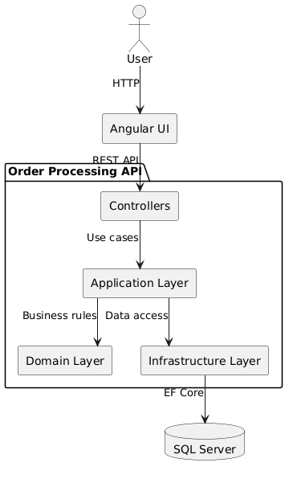
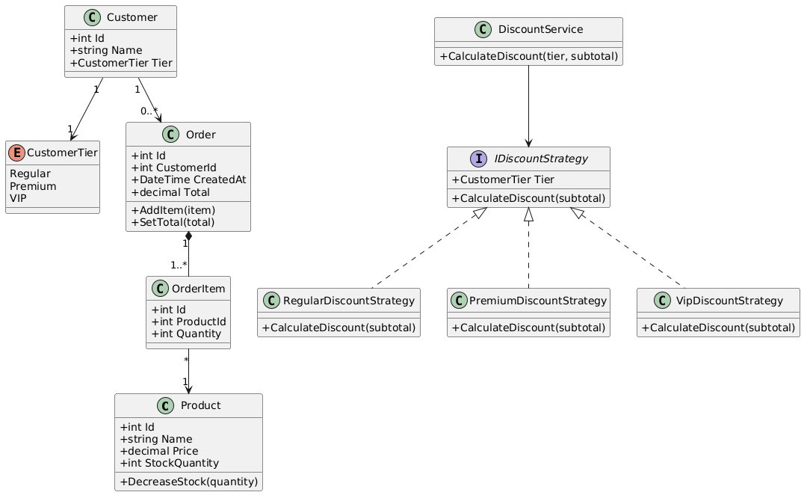

# Order Processing API

The project follows a layered architecture:

- API / Controllers
- Application
- Domain
- Infrastructure
- Tests



### Class Diagram



## Technologies

- .NET 8
- ASP.NET Core Web API
- Entity Framework Core
- SQL Server 2022
- Docker / Docker Compose
- xUnit
- Moq
- FluentValidation
- Swagger / OpenAPI

## Requirements

The following tools are required:

- Docker
- Docker Compose
- .NET 8 SDK
- Bash (Linux/macOS) or PowerShell (Windows)

## Running the Application

The project includes setup scripts for Linux/macOS and Windows.

The setup scripts automatically:

1. Create the required local `.env` file if it does not already exist.
2. Configure the SQL Server development environment.
3. Build the Docker image for the API.
4. Start SQL Server and the API using Docker Compose.

### Windows

From the project root, run:

```powershell
.\setup.ps1
````

If PowerShell prevents the script from running because of the execution policy, run:

```powershell
Set-ExecutionPolicy -Scope Process -ExecutionPolicy Bypass
```

Then run:

```powershell
.\setup.ps1
```

### Linux / macOS

From the project root, run:

```bash
chmod +x setup.sh
./setup.sh
```

## Accessing the API

Once the application is running:

* API: `http://localhost:8080`
* Swagger UI: `http://localhost:8080/swagger`

Swagger can be used to explore and test all available endpoints.

## Running Tests

The unit tests use xUnit and Moq.

From the project root:

```bash
dotnet test
```

## Architecture Overview

The project is organized into four main application layers.

### API

The API layer contains the controllers, request/response handling, API versioning, validation filters, and Swagger configuration.

Controllers are intentionally kept thin and delegate business logic to application services.

### Application

The Application layer contains the use cases and business orchestration.

It includes:

* Application services.
* DTOs.
* Validators.
* Repository interfaces.
* Discount strategies.

### Domain

The Domain layer contains the core business entities and rules:

* Product
* Customer
* Order
* OrderItem
* CustomerTier

### Infrastructure

The Infrastructure layer contains the implementation details for data access:

* Entity Framework Core.
* DbContext.
* EF Core configurations.
* Repository implementations.
* Database migrations.

## Design Patterns

### Strategy Pattern

The Strategy pattern is used for customer-tier discounts.

Each customer tier has its own discount strategy:

* `RegularDiscountStrategy` → 0%
* `PremiumDiscountStrategy` → 10%
* `VipDiscountStrategy` → 20%

All strategies implement:

```text
IDiscountStrategy
```

A `DiscountService` selects the appropriate strategy based on the customer's tier.

This keeps discount calculation extensible and avoids having tier-specific conditional logic inside `OrderService`.

### Repository Pattern

Repositories abstract data access from the application layer.

The application depends on repository interfaces, while their implementations are located in the Infrastructure layer.

This also makes the application services easier to unit test because repositories can be mocked.

### Registrar Pattern

Application and pipeline configuration is organized using the Registrar pattern.

Instead of placing all service registrations and middleware configuration directly in `Program.cs`, registrations are separated into dedicated classes.

This keeps `Program.cs` small and makes the application startup configuration easier to maintain.

## Database

The application uses SQL Server 2022 running in Docker.

The database is configured through Docker Compose and uses Entity Framework Core for persistence.

The database connection is configured automatically when the application is started through the setup scripts.

## Async Usage

The application uses `async`/`await` throughout the data-access and application layers.

Repository operations use asynchronous EF Core methods such as:

* `FirstOrDefaultAsync`
* `ToListAsync`
* `SaveChangesAsync`

Controller actions and application services also propagate asynchronous execution using `Task` and `CancellationToken`.

## Time Spent

Approximately **5** were spent implementing the solution, including the API, domain logic, persistence layer, validation, unit tests, Docker setup, UI and documentation.

## What I Would Improve With More Time

Given additional time, I would prioritize the following improvements:

### Integration Tests

Add integration tests using a test database or Testcontainers to verify the complete flow:

```text
HTTP Request
    ↓
Controller
    ↓
Application Service
    ↓
Repository
    ↓
Database
```

The current tests intentionally focus on unit testing the order creation logic by mocking repositories, as required by the exercise.

### Concurrency and Stock Consistency

Improve stock handling for concurrent orders.

For example, two requests could attempt to purchase the last available units of the same product at the same time. I would introduce appropriate database concurrency handling or optimistic concurrency using a `rowversion`/concurrency token.

### Transactions

Explicitly define transaction boundaries around order creation and stock updates to guarantee that the order and inventory changes are persisted atomically.

### API Error Model

Introduce a consistent problem-details based error response across the API, following RFC 7807, with structured error codes and messages.

### Authentication and Authorization

Add authentication and authorization if the API were intended for a real production environment.

### Observability

Add structured logging, metrics, and distributed tracing to make production troubleshooting easier.

### CI/CD

Add a CI pipeline to automatically:

1. Restore dependencies.
2. Build the solution.
3. Run unit tests.
4. Build the Docker image.
5. Optionally publish the application.

### API Documentation

Expand the OpenAPI documentation with request/response examples, possible error responses, and more detailed endpoint descriptions.

### Frontend

The project includes a simple Angular UI for interacting with the API. With more time, I would further improve its UX, error handling, loading states, and accessibility.

